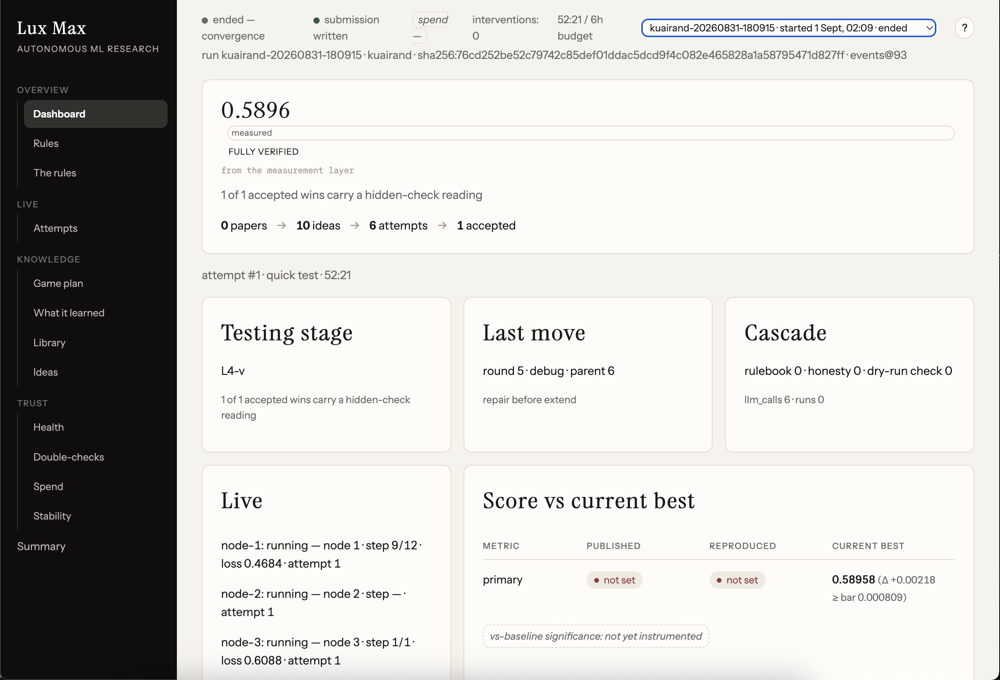
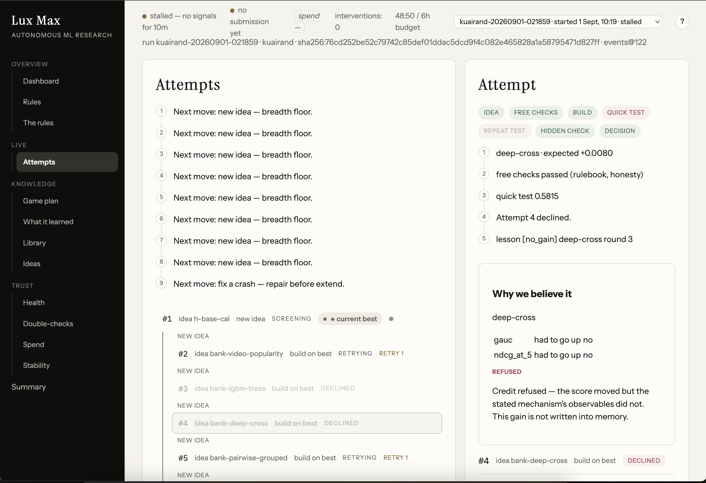
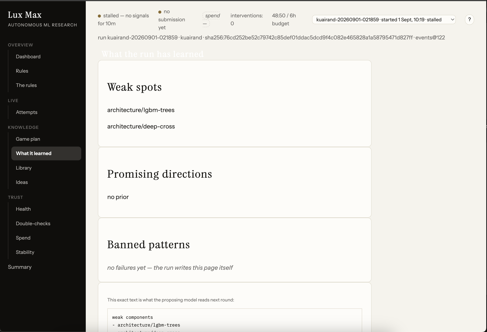
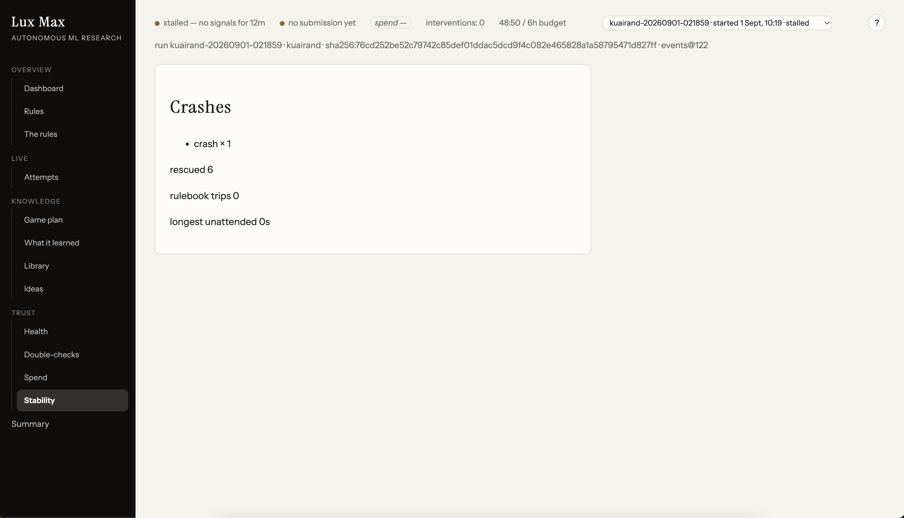
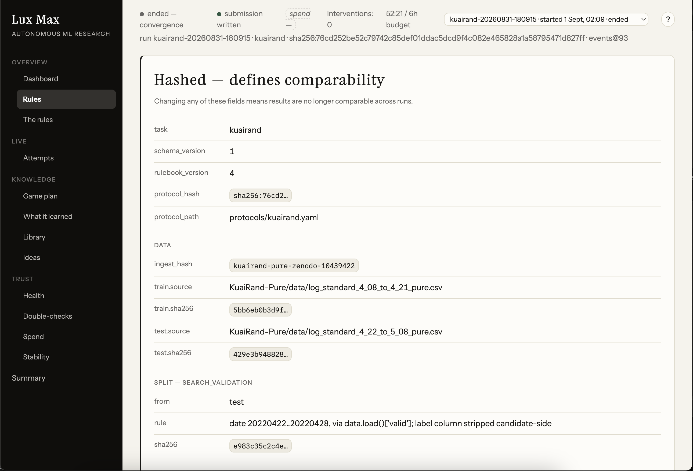
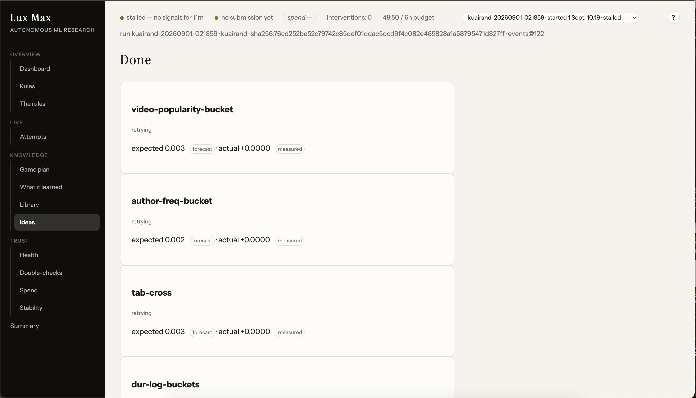

# Lux Max — an autonomous ML research harness

<video src="https://github.com/cmengu/TikTok-TechJam/raw/main/docs/luxmax-demo.mp4" controls width="100%"></video>

▶ [Watch the walkthrough](https://github.com/cmengu/TikTok-TechJam/raw/main/docs/luxmax-demo.mp4) (if the player above doesn't load)

**TikTok TechJam · KuaiRand-Pure track.** Point it at the dataset and walk away:
it proposes experiments, writes its own code changes, trains and scores them,
and decides — alone — which improvements are real. Ideas that fail become
lessons it reads before proposing again. Ideas that "win" must survive repeat
tests on fresh seeds, a hidden check they cannot train on, and an explanation
test: a gain that can't show *why* it happened is refused.

**Live dashboard:** https://luxmaxxing.vercel.app — every run in this
repo, rendered from its event log.

---

## Deliverables at a glance

Scored run: **`kuairand-20260831-180915`** — the run with a fully-gated
accepted improvement.

| Deliverable | Where |
|---|---|
| **4 · Final output** (KuaiRand-Pure) | [`runs/kuairand-20260831-180915/submission/pred.csv`](runs/kuairand-20260831-180915/submission/pred.csv) — 170,588 rows, passes the kit's `submit.py --check --split test` |
| **4 · Results table + resource usage** | [`runs/kuairand-20260831-180915/SUMMARY.md`](runs/kuairand-20260831-180915/SUMMARY.md) (machine-readable: `summary.json`) |
| **3 · Per-iteration log** | [`runs/kuairand-20260831-180915/iterations.jsonl`](runs/kuairand-20260831-180915/iterations.jsonl) — hypothesis, applied diff, metrics, errors and recoveries per attempt |
| **3 · Code diffs** | [`runs/kuairand-20260831-180915/patches/`](runs/kuairand-20260831-180915/patches/) — the actual diff applied at each iteration |
| **3 · Manual interventions** | **0** during the scored run (see [Autonomy](#autonomy-and-honesty)) |
| Raw event log (the source of every number) | `runs/kuairand-20260831-180915/events.jsonl` |
| Every other run we did | `runs/` — 11 kuairand runs, all logs committed |

### Results — KuaiRand-Pure

| | GAUC | nDCG@5 | primary |
|---|---|---|---|
| Official baseline (validation) | 0.6674 | 0.5357 | 0.6016 |
| Official baseline (hidden test) | 0.6610 | 0.5282 | 0.5946 |
| Our reproduction of their FM (validation) | 0.6671 | 0.5358 | 0.6015 |
| **This run, accepted candidate** | 0.6607\* | not recorded\* | **0.5896** |

**Absolute delta vs the official validation baseline: −0.0120.**

The accepted candidate's score is its **three-seed replicate mean** (0.58958),
the number the promotion was actually decided on — not the single-seed screen
reading, which runs higher and would flatter us.

\* The measurement ladder scores every attempt on the **primary** metric, so
per-attempt verdicts carry primary only; GAUC and nDCG@5 are computed by the
organisers' `evaluate.py` on every run but reach the log per-attempt only when
a hypothesis declares them as observables for the attribution gate. The
accepted iteration declared GAUC, hence 0.6607 (its screen reading; 0.6507 at
replicate); it did not declare nDCG@5, so no per-attempt value exists for it.
Recording the full metric triple on every attempt is a one-line change to the
verdict payload and the first thing we would fix.

We do not beat the organisers' baseline on absolute score, and we say so
plainly. Our port reproduces their FM almost exactly at full strength
(0.6015 vs 0.6016), but the search trains candidates at a reduced budget for
speed, so the loop starts from ≈0.5956 — everything the agent gained was
spent climbing back toward their starting line. What the agent *did* achieve is a
genuine, fully-certified improvement over its own baseline:

> **Iteration 4 (`dur-log-buckets`) — accepted.** Mean Δ **+0.0022** against a
> noise bar of 0.0008, with **all three seeds positive** (+0.0025, +0.0012,
> +0.0028) and attribution **clear** — the mechanism's declared observables
> moved in the direction the hypothesis predicted. It is the only change in
> any run that cleared every gate.

### Resource usage (scored run)

| | |
|---|---|
| LLM tokens | **182,739** (in + out) |
| Agent wall-clock | **0.87 h** |
| Iterations used | **6 of 50** |
| GPU-hours | **0** — CPU-only throughout |
| Manual interventions | **0** |

---

## See it running

Every screen below is a fold over the run's own append-only event log — the UI
computes nothing of its own. Browse them live at
[luxmaxxing.vercel.app](https://luxmaxxing.vercel.app).

### Dashboard

The funnel (`papers → ideas → attempts → accepted`), the verification stage
(**L4-v** — a closed loop gated by an external oracle the search cannot game),
the intervention counter, and *Score vs current best* showing the accepted
delta against the bar it had to clear.



### Library

The paper corpus with page-one covers, each card marked with whether this
particular run consulted it.


### Attempts

Every attempt with its move, its stage, and its verdict — and on the right,
*why we believe it*. Here the attribution gate **refuses credit** to
`deep-cross`: the score moved, but `gauc` and `ndcg_at_5` — the observables its
own hypothesis declared — did not, so the gain was never written into memory.



---

## What we took from the literature — eight capabilities

Every mechanism below is implemented, and the screenshot beside it is that
mechanism working in a real run — not a mockup.

### NOVA (Tencent) — the architecture gradient

**1 · Weak-component feedback.** Families are scored by measured history, so
the proposer is *told* which part of the pipeline is underperforming instead of
guessing. **2 · Forbidden directions.** Patterns the log already recorded as
failures are refused at proposal time — the agent cannot re-run a known dead
end. The page below writes itself from the run's own lessons, and the code
block at the bottom is the exact text the proposing model reads next round.
`harness/tree.py` (`family_stats`, `Queue.score_hyp`),
`harness/agents/researcher.py` (`_refuse_forbidden`).



### AgentX (Kuaishou) — don't trust an unexplained win

**3 · The attribution brake.** Every hypothesis declares observables and a
direction. Below is the brake firing on a real attempt: `deep-cross` moved the
score, but `gauc` and `ndcg_at_5` — the observables its own hypothesis named —
did not move, so **credit was refused and the gain was never written into
memory**. `harness/attribute.py`, gated in `harness/measure.py`.

(Shown in the **Attempts** screenshot above.)

**4 · Infrastructure failure as a first-class path.** A failed patch is retried
with the exact git error in hand, then rewritten whole-file, and every step is
logged rather than dying silently. This run crashed once and **rescued six**
attempts that would previously have been lost.
`harness/agents/coder.py` (`sanitize_diff`, `DIFF_ATTEMPTS`, full-file fallback).



### AIRA-dojo (Meta) — measure before you believe

**5 · Hidden consistent evaluation.** One fixed split, labels physically absent
from the candidate's environment, scoring done outside the candidate — and
every look at the hidden check counted against a budget. `harness/runner.py`
(`_build_env` whitelist), `harness/tasks/kuairand.py`.

**6 · A frozen, hashed protocol.** The data, the splits and the scorer are
pinned by SHA-256; changing any of them means results are no longer comparable,
and a changed `evaluate.py` stops the run rather than quietly changing the
numbers. `harness/protocol.py`, `protocols/kuairand.yaml`.



### AIDE (Weco) — the search itself

**7 · Draft / debug / improve tree.** Nodes are drafted from the queue,
repaired when they crash, and extended when they win, with greedy
keep-or-revert and a fork when a branch stalls — visible as the move trail
("new idea — breadth floor", "fix a crash — repair before extend") in the
Attempts screenshot above. `harness/tree.py`.

### MLE-bench (OpenAI) + MLE-STAR (Google) — never end with nothing, and attack the right component

**8 · Always-valid submission, watchdogs, and honest forecasts.** Every
accepted candidate is immediately re-run on the submission features and written
in the kit's schema; wall-clock limits and stall detection cover every attempt;
`scripts/rescue_submission.py` covers a run that converges without accepting
anything. MLE-STAR's ablation idea shows up as the forecast-vs-measured
discipline: each idea carries an *expected* gain, and the page shows what it
actually delivered beside it — `expected 0.003 (forecast) · actual +0.0000
(measured)`. `harness/outputs.py`, `harness/runner.py`.



---

## Architecture

Five decoupled stages that only talk through an **append-only event log**.
Nothing in the UI or the reports recomputes a number; every artefact in this
repo is a fold over that log.

1. **Hypothesis queue** — seeds from a cited idea bank
   (`hypotheses/bank.yaml`), refills from an **LLM researcher** that reads the
   run's own `lessons.jsonl` and is forbidden from re-proposing patterns the
   log already recorded as failures.
2. **LLM coder** — turns the chosen idea into a git-committed diff against the
   candidate model. A diff sanitizer, one error-carrying retry, and a
   full-file fallback mean ideas die on their science, not on patch mechanics.
3. **Sandboxed runner** — executes each candidate under an environment
   whitelist that physically withholds the test labels from the candidate
   process.
4. **Measurement ladder** — screens on one seed, replicates on three paired
   seeds against a bar calibrated to the task's own seed noise, and requires
   *every* seed to agree in sign.
5. **Promotion gates** — a budgeted unbiased wall (the sanctioned
   random-exposure log, which the search cannot train on) and an
   **attribution check**: a win must move the observables its own hypothesis
   declared, or it is refused.

Design lineage: **NOVA** and **AgentX** (the architecture gradient and the
attribution brake), **AIDE** (the draft/debug/improve tree), **AIRA-dojo**
(hidden consistent evaluation; their result that "agents overfit validation"
was largely evaluation noise), **MLE-STAR** (ablation to find the weak
component), **MLE-bench** (always-valid submissions, runtime watchdogs).

## Setup

```bash
git clone https://github.com/cmengu/TikTok-TechJam.git && cd TikTok-TechJam
python3.12 -m venv .venv && source .venv/bin/activate
pip install -e .                     # harness + deps (torch, lightgbm, numpy)
```

Place the organisers' starter kit (`KuaiRand-Pure`, `evaluate.py`, `data.py`,
`submit.py`) where `protocols/kuairand.yaml` points. The protocol pins
`evaluate.py` by SHA-256: if that file changes, runs refuse to score rather
than report a number from a different scorer.

## Reproduce our results

```bash
# 1. the run itself (unattended; ~50 min on a laptop CPU)
python -m harness run protocols/kuairand.yaml --max-nodes 50

# 2. the judge artefacts for any run — iteration log, results, resources
python scripts/export_iterations.py <run-id>

# 3. validate the submission with the organisers' own checker
python3 submit.py --check --split test runs/<run-id>/submission/pred.csv

# 4. watch it live (or browse any past run)
python -m uvicorn app.server:app --port 8000    # http://127.0.0.1:8000
```

`scripts/rescue_submission.py <run-id>` writes a submission for a run that
converged without promoting anything — the validation-best candidate is then
the baseline, and the rules still ask for a file.

Tests: `python -m pytest tests` (308) and `node --test "app/static/*.test.js"`
(301). Everything was built test-first.

## Autonomy and honesty

The scored run had **zero manual interventions**. Development history, fully
disclosed: earlier runs were aborted by the operator after a chain of
patch-apply defects (miscounted hunk headers, a stripped trailing newline,
prose leaking into diff bodies). Each fix landed with red-first tests, then a
clean restart. The final agent recovers from a failed patch by retrying with
the git error in hand, falling back to a full-file rewrite, and — if that
fails — failing the node, writing the lesson, and moving on. Every one of
those recoveries is an event in the log (`patch_retried`,
`fullfile_fallback`), so the audit page counts what the loop survived, not
only what it won.

We also audited our **own dashboard for lying**. It once announced
"Attempt 3 passed the tests, but the win is unexplained" about an experiment
that had been *rejected* with all three seeds negative — the narration keyed
off a side-field before checking the actual decision. We replayed every run's
raw event log through the sentence renderer, diffed what the UI *would say*
against what the harness *actually decided*, found four false sentences, and
rebuilt the narration so a sentence that cannot cite its deciding event does
not render. Dead runs now say "stalled", and an empty score carries no
provenance stamp. Write-up: `context/Unexplained_win_investigation.md`.

## Limitations, and what we'd do next

- **The search runs on a weakened baseline.** Our port reproduces their FM
  faithfully at full strength (0.6015 vs 0.6016 validation), but the loop
  trains candidates at a reduced budget for speed, which starts the search at
  ≈0.5956. Everything the agent gained was spent climbing back. Running the
  search at full training strength is the single highest-value fix and would
  turn the agent's real +0.0022 into a positive absolute delta.
- **The researcher rarely gets a turn.** It only proposes once the seeded
  queue drains, and for most of our history plumbing failures ate the budget
  first. The throughput fixes landed late; the next milestone is a run where
  most hypotheses are agent-proposed rather than seeded.
- **Model-class changes underperformed.** LightGBM (−0.0062) and a
  DCNv2-style deep-cross (−0.0149) were both rejected — one-shot LLM diffs
  rewriting an entire model, on a training budget tuned for the FM, is asking
  a lot. Staged multi-diff construction would be fairer to those ideas.
- **Single machine, CPU only.** No GPU was used, which caps how many seeds and
  epochs a run can afford.
- **Bonus benchmarks skipped.** KuaiRand-1k and 27k were deliberately not
  attempted, to protect the deadline.


---
